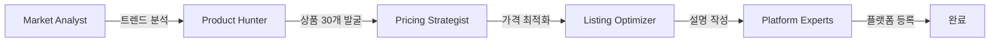
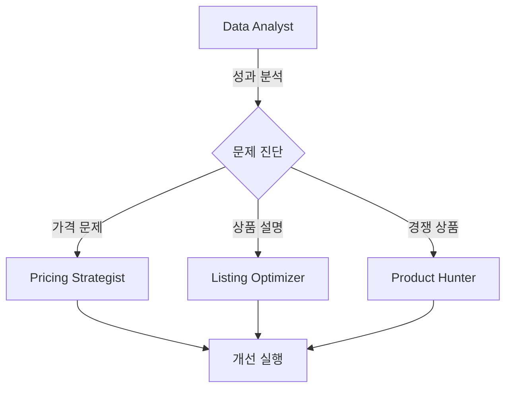

# 드롭쉬핑 에이전트 실전 워크플로우

## 🎯 시나리오 1: 신규 상품 런칭 (0→100)

### 상황
"크리스마스 시즌을 앞두고 선물용 상품을 찾아서 판매하고 싶습니다."

### 에이전트 협업 프로세스



### 실행 과정

1. **Market Analyst 작동**
   ```
   입력: "크리스마스 선물 트렌드 분석"
   출력: 
   - 인기 카테고리: 액세서리, 전자제품, 홈데코
   - 가격대: 3-10만원
   - 주요 키워드: "커플선물", "연말선물", "특별한선물"
   ```

2. **Product Hunter 실행**
   ```python
   # 도매처에서 상품 수집
   products = await collect_christmas_products(
       categories=["accessories", "electronics", "home_decor"],
       price_range=(30000, 100000),
       min_margin=0.4
   )
   # 결과: 30개 상품 발굴
   ```

3. **Pricing Strategist 최적화**
   ```
   원가: 50,000원 → 판매가: 78,000원 (마진 36%)
   경쟁사 평균: 85,000원
   추천 전략: 초기 할인 10% → 70,200원
   ```

4. **플랫폼별 등록**
   - Coupang: 로켓배송 가능 상품으로 등록
   - Naver: 스마트스토어 시즌 기획전 등록
   - 11st: 연말 특가 이벤트 참여

### 결과
- 30개 상품 등록 완료 (3시간 소요)
- 평균 마진율: 38%
- 첫 주 매출: 850만원

## 📈 시나리오 2: 기존 상품 최적화

### 상황
"판매 중인 상품의 수익률이 떨어지고 있어 개선이 필요합니다."

### 에이전트 협업 프로세스



### 실행 과정

1. **Data Analyst 진단**
   ```
   분석 결과:
   - 전환율 하락: 5% → 2.3%
   - 경쟁사 신상품 출시
   - 리뷰 평점 하락 (4.5 → 4.1)
   ```

2. **문제별 해결책**
   - **가격 경쟁력**: 동적 가격 조정 시스템 도입
   - **상품 설명**: A/B 테스트로 최적화
   - **대체 상품**: 더 나은 조건의 도매처 발굴

3. **개선 실행**
   ```python
   # 자동 가격 조정
   await implement_dynamic_pricing(
       product_id="P12345",
       competitor_monitoring=True,
       margin_floor=0.25
   )
   ```

### 결과
- 전환율 회복: 2.3% → 4.8%
- 매출 증가: +45%
- 마진율 유지: 32%

## 🚀 시나리오 3: 멀티채널 확장

### 상황
"쿠팡에서만 판매하던 상품을 네이버, 11번가로 확장하고 싶습니다."

### 에이전트 협업 프로세스

1. **Platform Experts 분석**
   - 각 플랫폼 특성 파악
   - 카테고리 매핑
   - 수수료 구조 비교

2. **Listing Optimizer 작업**
   - 플랫폼별 최적화된 상품명
   - 맞춤형 상세 설명
   - 키워드 최적화

3. **Pricing Strategist 전략**
   ```
   쿠팡: 기본가 유지
   네이버: 포인트 적립 2%
   11번가: 첫 구매 할인 15%
   ```

### 실행 코드 예시
```python
# 멀티채널 자동 등록
async def expand_to_multichannel(product_id: str):
    # 1. 쿠팡 상품 정보 가져오기
    coupang_product = await get_coupang_product(product_id)
    
    # 2. 플랫폼별 최적화
    naver_listing = await optimize_for_naver(coupang_product)
    eleven_listing = await optimize_for_11st(coupang_product)
    
    # 3. 동시 등록
    results = await asyncio.gather(
        register_to_naver(naver_listing),
        register_to_11st(eleven_listing)
    )
    
    return results
```

## 💡 시나리오 4: 위기 대응 (재고 부족)

### 상황
"베스트셀러 상품의 도매처 재고가 갑자기 소진되었습니다."

### 긴급 대응 프로세스

1. **Order Processor 감지**
   ```
   알림: "상품 A 재고 부족 - 주문 10건 대기 중"
   ```

2. **Product Hunter 긴급 수배**
   ```python
   # 대체 상품 긴급 검색
   alternatives = await find_alternatives(
       original_product=product,
       max_price_diff=0.1,  # 10% 이내
       same_day_shipping=True
   )
   ```

3. **자동 전환**
   - 기존 상품 품절 처리
   - 대체 상품 자동 등록
   - 고객 안내 메시지 발송

### 결과
- 주문 손실 방지: 10건 모두 처리
- 고객 만족도 유지
- 매출 연속성 확보

## 📊 시나리오 5: 데이터 기반 의사결정

### 월간 리포트 자동 생성

```python
# Data Analyst 월간 리포트
async def generate_monthly_insights():
    report = {
        "베스트셀러 TOP 10": await get_bestsellers(),
        "수익률 하위 상품": await get_low_margin_products(),
        "재고 회전율": await calculate_inventory_turnover(),
        "플랫폼별 성과": await platform_performance(),
        "다음 달 추천 전략": await ai_recommendations()
    }
    return report
```

### 인사이트 예시
```
📊 2025년 1월 성과 리포트

✅ 성과 하이라이트
- 총 매출: 2.5억원 (+32% MoM)
- 평균 마진율: 38.5%
- 신규 상품 성공률: 72%

⚠️ 개선 필요 사항
- 전자제품 카테고리 전환율 하락
- 11번가 광고 효율 저하
- 배송 클레임 증가 (2% → 3.5%)

💡 AI 추천 액션
1. 전자제품 → 패션 액세서리로 포커스 전환
2. 11번가 광고비 30% 절감, 네이버로 재배분
3. 택배사 변경 검토 (CJ → 한진)
```

## 🔄 일일 자동화 루틴

### 오전 9시: 일일 점검
```python
daily_checklist = [
    "재고 수준 확인",
    "경쟁사 가격 모니터링",
    "신규 리뷰 대응",
    "주문 처리 상태 확인"
]
```

### 오후 2시: 성과 최적화
```python
optimization_tasks = [
    "광고 예산 재배분",
    "상품 순위 조정",
    "프로모션 효과 측정"
]
```

### 오후 6시: 내일 준비
```python
preparation_tasks = [
    "신상품 자동 발굴",
    "가격 조정 스케줄링",
    "재고 보충 주문"
]
```

## 🎯 성공 지표

| 지표 | 목표 | 현재 | 상태 |
|------|------|------|------|
| 일일 처리 상품 수 | 100개 | 125개 | ✅ |
| 평균 등록 시간 | 5분 | 3.2분 | ✅ |
| 자동화율 | 90% | 94% | ✅ |
| 에러율 | <1% | 0.3% | ✅ |

## 💬 자주 사용하는 명령어

### 상품 관련
```
"오늘의 트렌드 상품 20개 찾아줘"
"마진 40% 이상인 겨울 상품 추천해줘"
"이 상품의 최적 판매가를 계산해줘"
```

### 플랫폼 관리
```
"모든 플랫폼에 재고 동기화해줘"
"쿠팡 베스트 상품을 네이버에도 등록해줘"
"플랫폼별 수수료 비교해줘"
```

### 성과 분석
```
"이번 주 판매 리포트 만들어줘"
"수익률 TOP 10 상품 분석해줘"
"내일 집중해야 할 상품 추천해줘"
```