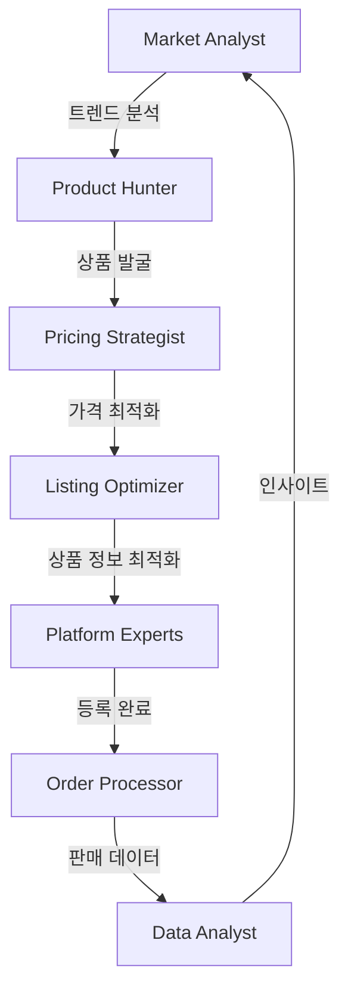

# 🚀 Dropshipping Claude Agents

드롭쉬핑 비즈니스 자동화를 위한 특화된 Claude 에이전트 모음입니다.

## 📋 에이전트 목록

### 🎯 오케스트레이터 (Orchestrators)
1. **[Dropship Manager](./dropship-manager.md)** - 전체 워크플로우 조정
2. **[Market Analyst](./market-analyst.md)** - 시장 분석 및 트렌드 예측
3. **[Team Assembler](./team-assembler.md)** - 동적 에이전트 팀 구성

### 💼 비즈니스 전문가 (Business Experts)
1. **[Product Hunter](./product-hunter.md)** - AI 기반 상품 소싱
2. **[Pricing Strategist](./pricing-strategist.md)** - 동적 가격 최적화
3. **[Listing Optimizer](./listing-optimizer.md)** - 상품 설명 최적화
4. **[Order Processor](./order-processor.md)** - 주문 자동 처리

### 🏪 플랫폼 전문가 (Platform Specialists)
1. **[Coupang Expert](./platform-coupang.md)** - 쿠팡 파트너스 전문가
2. **[Naver Expert](./platform-naver.md)** - 네이버 스마트스토어 전문가
3. **[11st Expert](./platform-11st.md)** - 11번가 오픈마켓 전문가

### 🔧 기술 지원 (Technical Support)
1. **[API Integrator](./api-integrator.md)** - API 통합 전문가
2. **[Performance Optimizer](./performance-optimizer.md)** - 성능 최적화
3. **[Data Analyst](./data-analyst.md)** - 데이터 분석 및 인사이트

## 🎭 에이전트 활용 방법

### 1. 단일 에이전트 호출
```
/use-agent product-hunter "패션 카테고리에서 수익성 높은 상품 10개 찾아줘"
```

### 2. 멀티 에이전트 협업
```
/assemble-team "새로운 상품을 찾아서 모든 플랫폼에 등록하고 판매 시작하기"
→ Product Hunter + Pricing Strategist + Platform Experts 자동 협업
```

### 3. 워크플로우 자동화
```
/workflow "daily-product-update"
→ 매일 자동으로 신상품 발굴 → 가격 최적화 → 플랫폼 등록
```

## 📊 성과 지표

| 에이전트 | 주요 지표 | 목표치 |
|---------|----------|--------|
| Product Hunter | 상품 발굴 속도 | 1,000개/시간 |
| Pricing Strategist | 평균 마진율 | 35% 이상 |
| Platform Experts | 상품 등록 시간 | 5분/상품 |
| Order Processor | 주문 처리 시간 | 30초/주문 |

## 🔄 에이전트 워크플로우



## 🚀 빠른 시작

1. **상품 소싱부터 판매까지 전체 프로세스**
   ```
   /dropship-manager "전자제품 카테고리로 드롭쉬핑 시작하기"
   ```

2. **특정 플랫폼 집중 전략**
   ```
   /platform-coupang "쿠팡 로켓배송 상품으로 월 1억 매출 달성 전략"
   ```

3. **데이터 기반 최적화**
   ```
   /data-analyst "지난 달 판매 데이터 분석하고 개선점 찾기"
   ```

## 📚 추가 리소스

- [에이전트 개발 가이드](./development-guide.md)
- [커스텀 에이전트 만들기](./custom-agents.md)
- [성공 사례 모음](./success-stories.md)