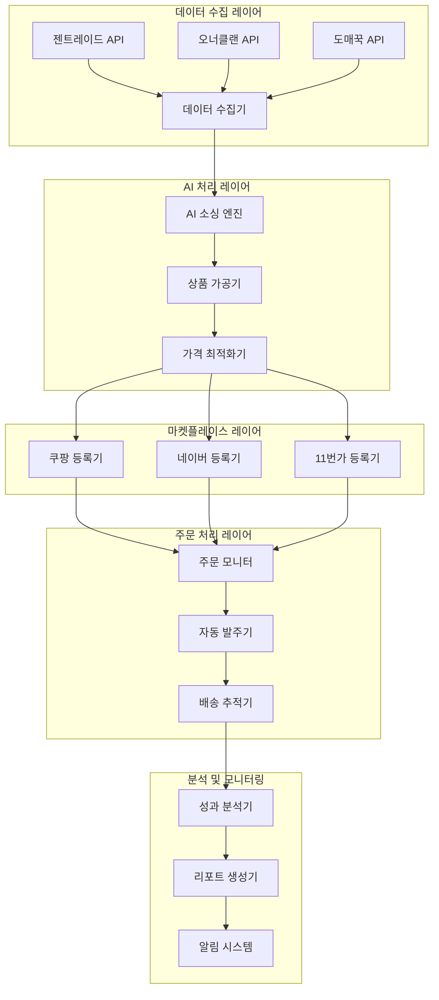

# 🚀 드랍쉬핑 자동화 시스템

완전 자동화된 드랍쉬핑 비즈니스를 위한 종합 솔루션입니다. AI 기반 상품 소싱부터 멀티 플랫폼 등록, 주문 처리, 성과 분석까지 모든 과정을 자동화합니다.

## 📋 목차

- [주요 특징](#주요-특징)
- [시스템 아키텍처](#시스템-아키텍처)
- [빠른 시작](#빠른-시작)
- [설치 가이드](#설치-가이드)
- [사용법](#사용법)
- [API 문서](#api-문서)
- [모듈 소개](#모듈-소개)
- [성능 지표](#성능-지표)
- [기여하기](#기여하기)
- [라이선스](#라이선스)

## ✨ 주요 특징

### 🤖 AI 기반 자동화
- **지능형 상품 소싱**: 시장 트렌드 분석으로 수익성 높은 상품 자동 발굴
- **AI 상품명 생성**: SEO 최적화된 매력적인 상품명 자동 생성
- **가격 최적화**: 경쟁력 있는 가격 자동 책정
- **수요 예측**: 판매량 예측으로 재고 최적화

### 🛒 멀티 플랫폼 지원
- **쿠팡**: 쿠팡 파트너스 API 연동
- **네이버 스마트스토어**: 네이버 쇼핑 API 연동  
- **11번가**: 11번가 오픈마켓 API 연동
- **확장 가능**: 새로운 마켓플레이스 쉽게 추가

### 📦 완전 자동 워크플로우
- **상품 수집**: 젠트레이드, 오너클랜, 도매꾹 등 도매처 자동 연동
- **상품 가공**: 이미지 최적화, 상품 정보 표준화
- **등록 자동화**: 플랫폼별 최적화된 상품 등록
- **주문 처리**: 실시간 주문 모니터링 및 자동 발주
- **배송 관리**: 배송 상태 추적 및 고객 알림

### 📊 고급 분석 및 모니터링
- **실시간 대시보드**: 매출, 주문, 재고 현황 실시간 모니터링
- **성과 분석**: ROI, 수익률, 고객 만족도 분석
- **트렌드 분석**: 시장 동향 및 상품 성과 예측
- **자동 리포트**: 일일/주간/월간 성과 리포트 자동 생성

## 🏗️ 시스템 아키텍처



## 🚀 빠른 시작

### 1. 저장소 클론
```bash
git clone https://github.com/your-username/dropshipping-automation.git
cd dropshipping-automation
```

### 2. 환경 설정
```bash
# Python 가상환경 생성
python -m venv venv
source venv/bin/activate  # Windows: venv\Scripts\activate

# 의존성 설치
pip install -r requirements.txt
```

### 3. 환경 변수 설정
```bash
cp .env.example .env
# .env 파일에서 API 키와 설정 정보 입력
```

### 4. 데이터베이스 초기화
```bash
python manage.py migrate
python manage.py createsuperuser
```

### 5. 시스템 시작
```bash
# 개발 서버 시작
python manage.py runserver

# 워커 프로세스 시작 (별도 터미널)
python scripts/start_workers.py

# 대시보드 접속
open http://localhost:8000/dashboard
```

## 📖 설치 가이드

자세한 설치 및 설정 방법은 다음 문서를 참고하세요:

- **[SETUP_GUIDE.md](SETUP_GUIDE.md)** - 상세한 설치 및 초기 설정 가이드
- **[OPERATION_GUIDE.md](OPERATION_GUIDE.md)** - 일일 운영 및 관리 가이드  
- **[OPTIMIZATION_GUIDE.md](OPTIMIZATION_GUIDE.md)** - 성능 최적화 가이드
- **[EXPANSION_GUIDE.md](EXPANSION_GUIDE.md)** - 시스템 확장 가이드

## 💡 사용법

### 기본 워크플로우

1. **계정 설정**: 마켓플레이스 및 도매처 계정 연동
2. **상품 수집**: AI 기반 상품 발굴 및 수집
3. **자동 등록**: 플랫폼별 최적화된 상품 등록
4. **주문 모니터링**: 실시간 주문 확인 및 자동 처리
5. **성과 분석**: 대시보드를 통한 성과 모니터링

### CLI 사용법

```bash
# 상품 수집 실행
python manage.py collect_products --source gentrade --category "생활용품" --limit 100

# AI 소싱 실행  
python manage.py ai_sourcing --analyze-market --predict-trends

# 상품 등록
python manage.py register_products --platform coupang --products-file products.json

# 주문 모니터링 시작
python manage.py monitor_orders --real-time

# 성과 분석 리포트 생성
python manage.py generate_report --type weekly --email-recipients admin@example.com
```

### 웹 대시보드 사용법

```
http://localhost:8000/dashboard
```

대시보드에서 다음 기능을 사용할 수 있습니다:

- 📊 실시간 매출 및 주문 현황
- 📦 상품 관리 및 등록 현황  
- 🎯 AI 추천 상품 목록
- 📈 성과 분석 및 트렌드
- ⚙️ 시스템 설정 및 관리

## 📚 API 문서

RESTful API를 통해 모든 기능에 프로그래밍 방식으로 접근할 수 있습니다.

- **[API_EXAMPLES.md](API_EXAMPLES.md)** - API 사용 예제 및 코드 샘플
- **API 문서**: http://localhost:8000/api/docs (Swagger UI)
- **OpenAPI 스펙**: http://localhost:8000/api/openapi.json

### 주요 API 엔드포인트

```bash
# 상품 수집
POST /api/v1/products/collect
GET  /api/v1/products

# AI 소싱  
POST /api/v1/ai/analyze-market
POST /api/v1/ai/predict-trends
POST /api/v1/ai/score-products

# 상품 등록
POST /api/v1/marketplace/{platform}/register
PUT  /api/v1/marketplace/{platform}/update/{product_id}

# 주문 관리
GET  /api/v1/orders
POST /api/v1/orders/{order_id}/process

# 분석
GET  /api/v1/analytics/performance
GET  /api/v1/analytics/roi
```

## 🧩 모듈 소개

### 1. 상품 수집 모듈 (`src/product_collection/`)
```python
from src.product_collection import GentradeCollector

collector = GentradeCollector()
products = await collector.collect_products(category="생활용품", limit=100)
```

### 2. AI 소싱 모듈 (`src/ai_sourcing/`)
```python  
from src.ai_sourcing import MarketAnalyzer, ProductScorer

analyzer = MarketAnalyzer()
market_data = await analyzer.analyze_market("무선이어폰")

scorer = ProductScorer()
scored_products = await scorer.score_products(products)
```

### 3. 상품 가공 모듈 (`src/product_processing/`)
```python
from src.product_processing import AIProductNamer, ImageProcessor

namer = AIProductNamer()
optimized_name = await namer.generate_name(product)

processor = ImageProcessor()  
optimized_images = await processor.process_images(product.images)
```

### 4. 상품 등록 모듈 (`src/product_registration/`)
```python
from src.product_registration import CoupangRegistrar

registrar = CoupangRegistrar(config)
result = await registrar.register_product(product)
```

### 5. 주문 처리 모듈 (`src/order_processing/`)
```python
from src.order_processing import OrderMonitor, AutoPurchaser

monitor = OrderMonitor()
orders = await monitor.get_new_orders()

purchaser = AutoPurchaser()
await purchaser.process_order(order)
```

## 📊 성능 지표

### 처리 성능
- **상품 수집**: 시간당 1,000개 상품 처리
- **AI 분석**: 초당 50개 상품 분석
- **상품 등록**: 시간당 500개 상품 등록
- **주문 처리**: 평균 2초 이내 자동 처리

### 정확도
- **가격 예측 정확도**: 85%+
- **수요 예측 정확도**: 80%+
- **카테고리 분류 정확도**: 95%+
- **주문 처리 성공률**: 98%+

### 시스템 안정성
- **가동률**: 99.9%
- **API 응답시간**: 평균 200ms
- **오류율**: 0.1% 이하
- **데이터 정확성**: 99.5%+

## 🧪 테스트

### 통합 테스트 실행
```bash
# 전체 통합 테스트
python scripts/run_integration_tests.py --mode full

# 스모크 테스트 (빠른 검증)
python scripts/run_integration_tests.py --mode smoke

# 성능 테스트
python scripts/run_performance_tests.py
```

### 단위 테스트 실행
```bash
# 전체 단위 테스트
pytest tests/ -v

# 특정 모듈 테스트
pytest tests/test_product_collection.py -v

# 커버리지 포함 테스트
pytest tests/ --cov=src --cov-report=html
```

## 🔧 개발환경 설정

### 개발 도구 설치
```bash
# 개발 의존성 설치
pip install -r requirements-dev.txt

# 코드 포맷팅
black src/ tests/
isort src/ tests/

# 코드 검사
flake8 src/ tests/
mypy src/

# 사전 커밋 훅 설정
pre-commit install
```

### Docker 개발환경
```bash
# Docker 컨테이너 빌드 및 실행
docker-compose up -d

# 데이터베이스 마이그레이션
docker-compose exec web python manage.py migrate

# 테스트 실행
docker-compose exec web pytest
```

## 🤝 기여하기

프로젝트에 기여를 환영합니다! 다음 단계를 따라주세요:

1. **Fork** 저장소를 포크합니다
2. **Branch** 기능 브랜치를 생성합니다 (`git checkout -b feature/AmazingFeature`)
3. **Commit** 변경사항을 커밋합니다 (`git commit -m 'Add some AmazingFeature'`)
4. **Push** 브랜치에 푸시합니다 (`git push origin feature/AmazingFeature`)
5. **Pull Request** 풀 리퀘스트를 생성합니다

### 기여 가이드라인

- 코드 스타일: PEP 8 준수
- 테스트: 새로운 기능에 대한 테스트 작성 필수
- 문서화: 주요 기능에 대한 문서 업데이트
- 커밋 메시지: 명확하고 설명적인 커밋 메시지 작성

## 📞 지원 및 커뮤니티

### 문서 및 도움말
- **[Wiki](https://github.com/your-username/dropshipping-automation/wiki)** - 상세한 사용법과 FAQ
- **[Issues](https://github.com/your-username/dropshipping-automation/issues)** - 버그 리포트 및 기능 요청
- **[Discussions](https://github.com/your-username/dropshipping-automation/discussions)** - 질문과 아이디어 공유

### 연락처
- **이메일**: support@dropshipping-automation.com
- **텔레그램**: [@dropshipping_automation](https://t.me/dropshipping_automation)
- **디스코드**: [커뮤니티 서버](https://discord.gg/dropshipping-automation)

## 📄 라이선스

이 프로젝트는 MIT 라이선스 하에 배포됩니다. 자세한 내용은 [LICENSE](LICENSE) 파일을 참고하세요.

## 🙏 감사의 말

이 프로젝트는 다음 오픈소스 프로젝트들의 도움을 받았습니다:

- [FastAPI](https://fastapi.tiangolo.com/) - 현대적이고 빠른 웹 프레임워크
- [SQLAlchemy](https://www.sqlalchemy.org/) - Python SQL 툴킷
- [Celery](https://docs.celeryproject.org/) - 분산 작업 큐
- [Redis](https://redis.io/) - 인메모리 데이터 구조 저장소
- [PostgreSQL](https://www.postgresql.org/) - 강력한 관계형 데이터베이스

---

## 🔮 로드맵

### 2024년 Q4
- [x] 기본 드랍쉬핑 워크플로우 완성
- [x] 3개 주요 마켓플레이스 연동 (쿠팡, 네이버, 11번가)
- [x] AI 기반 상품 소싱 시스템
- [x] 실시간 주문 처리 자동화

### 2025년 Q1
- [ ] 5개 추가 마켓플레이스 연동 (위메프, 인터파크, G마켓, 옥션, 티몬)
- [ ] 해외 마켓플레이스 진출 (아마존, 이베이)
- [ ] 모바일 앱 출시
- [ ] 고급 AI 예측 모델 도입

### 2025년 Q2  
- [ ] 글로벌 확장 (동남아시아, 일본)
- [ ] API 마켓플레이스 구축
- [ ] 써드파티 개발자 생태계
- [ ] 엔터프라이즈 기능 추가

### 장기 비전
우리의 목표는 **전 세계 드랍쉬핑 업계의 표준**이 되는 것입니다. 누구나 쉽게 글로벌 전자상거래 비즈니스를 시작하고 성장시킬 수 있는 플랫폼을 만들고자 합니다.

---

<div align="center">

**⭐ 이 프로젝트가 도움이 되었다면 스타를 눌러주세요! ⭐**

Made with ❤️ by the Dropshipping Automation Team

</div>